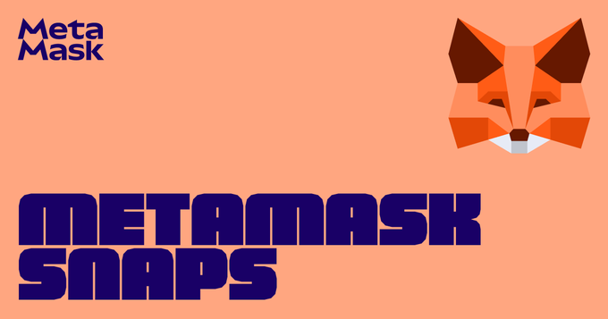

Fusaka upgrade live on mainnet, client diversity: Lighthouse 55%, Beacon chain 5th anniversary

### Ecosystem

* 🦓 [Fusaka upgrade](https://x.com/ethereum/status/1996258202669695080) live on mainnet:  
  * EthStaker [watch party](https://www.youtube.com/live/upns65rH7mQ?t=522s) recording & [POAPs](https://ethereumupgrades.com/#poap); Song a Day: [Ok Fusaka](https://x.com/songadaymann/status/1996239920914927807)  
  * Prysm (consensus layer client) [issue](https://x.com/terencechain/status/1996447340388073944) caused \~20% drop in participation, network recovered after config flag workaround used by affected nodes  
  * Headliner: [EIP7594](https://forkcast.org/upgrade/fusaka/#eip-7594) PeerDAS, allows 8x blobs as nodes only store 1/8 data  
  * [EIP7892](https://forkcast.org/upgrade/fusaka/#eip-7892) blob parameter only upgrades (BPOs) increase blobs gradually  
    * [BPO1](https://lab.ethpandaops.io/ethereum/forks/bpo1): target 10 & max 15 blobs per block (increased from 6/9), December 9   
    * [BPO2](https://lab.ethpandaops.io/ethereum/forks/bpo2): target 14 & max 21 blobs, January 7, 2026  
* [Client diversity](https://clientdiversity.org/#distribution):  
  * Consensus layer: ⚠️ Lighthouse 55%  
  * Execution layer: Geth \~41%, Nethermind \~38% (estimated from self reports)  
* [Beacon chain](https://blog.ethereum.org/2021/01/20/the-state-of-eth2-january-2021) 5th anniversary 🎂  
* EF Ecosystem Support Program [Q3 allocations](https://blog.ethereum.org/2025/12/02/allocation-q3-25), 80 projects shared $14.3M  
* ETH metrics:  
  * [Gas](https://ultrasound.money/#gas) (gwei): 0.1 average, 0.0 \- 2.7 (12 for zero net issuance)  
  * [ETHUSD](https://www.coingecko.com/en/coins/ethereum): $2,736 – $3,222 (all time high $4,946, August 24, 2025\)  
  * [ETH ETFs](https://dune.com/hildobby/eth-etfs): 5% of ETH supply  
  * [ETHBTC](https://ratiogang.com/): 0.034 (0.165 for the Flippening)

---

### Sponsor: [MetaMask](https://metamask.io)

 
Snaps are apps that customize your wallet experience and let you add new features and functionalities to MetaMask.  

[Get started with Snaps](https://metamask.io/snaps).

---

### Enterprise

* [Vanguard](https://investor.vanguard.com/investor-resources-education/article/cryptocurrencies-and-vanguard-what-we-think) allows trading of select third party crypto ETFs & mutual funds  
* [WisdomTree](https://x.com/WisdomTreeEU/status/1996544658067841133) Lido staked Ether ETP

### Applications

* [Aave x CoW Swap](https://aave.com/blog/aave-cow-swap): better prices & MEV protection  
* [Aave](https://snapshot.org/#/s:aavedao.eth/proposal/0xeb05b887d9db47d2f4a42d4f4fcb7141080d091dc8c1b32e9a75597071f949ea) voted to remove USDS as collateral  
* [Startale USD](https://startale.com/en/blog/startale-usd) (USDSC) stablecoin native to Soneium (Sony Block Solutions Labs rollup)  
* MetaMask [Transaction Shield](https://metamask.io/news/introducing-metamask-transaction-shield) (subscription): coverage (up to $10k) for transactions deemed safe & priority support, browser extension only  
* [Address.vision](https://x.com/austingriffith/status/1995549334331662338) POAP display for ENS addresses

### Developers

* Solidity (language)   
  * [v0.8.31](https://www.soliditylang.org/blog/2025/12/03/solidity-0.8.31-release-announcement):  
    * Fusaka support: osaka default EVM version & CLZ opcode  
    * Constants in storage layout specifiers  
    * Deprecation warnings for address send/transfer, ABI coder v1, virtual modifiers, contract comparison operators & memory safe assembly annotation  
  * [Solidity summit](https://www.soliditylang.org/blog/2025/12/04/solidity-summit-2025-recap/) (Devconnect) recordings & slides  
* Hardhat (dev framework) [Fusaka support](https://x.com/HardhatHQ/status/1996221326848053723) enabled manually in network config  
* Ethers.js [v6.16.0](https://github.com/ethers-io/ethers.js/releases/tag/v6.16.0) (client library): Fusaka support for EIP7594 PeerDAS cell proofs  
* [FloatLib](https://hackmd.io/@cavalre/high-precision-solidity) (Solidity/Vyper): high-precision floating-point math library   
* Enscribe: [name contracts with Basenames](https://www.enscribe.xyz/blog/basenames)  
* [Icon registry](https://github.com/igor53627/iconregistry.eth#readme): mainnet repository of PNG icons  
* Application layer standards (ERCs):  
  * [ERC8095](https://github.com/ethereum/ERCs/pull/1384/files): Directory of certified smart contracts  
  * [ERC8097](https://github.com/ethereum/ERCs/pull/1387/files): In ground asset token  
  * [ERC8098](https://github.com/ethereum/ERCs/pull/1390/files): Non-increasing supply ERC20

### Security

* Yearn: [$9M exploit](https://x.com/yearnfi/status/1995344733154250993) of yETH stableswap pool, [post mortem](https://github.com/banteg/yeth-exploit/blob/main/report.pdf); [$2.4M recovered](https://x.com/yearnfi/status/1995488425785659492)  
* Anthropic: [AI agents found exploits](https://red.anthropic.com/2025/smart-contracts/) in \~50% of previously exploited contracts

### All core devs (main protocol calls)

#### All core devs \- execution (ACDE) [\#225](https://forkcast.org/calls/acde/225)

* [Fusaka](https://forkcast.org/upgrade/fusaka) upgrade:  
  * [Post upgrade issues](https://notes.ethereum.org/Qcl9AZy6SiWAoTCSwDUTJg?view): Prysm plan client release & post mortem next week    
* [Glamsterdam](https://forkcast.org/upgrade/glamsterdam) upgrade (targeting June 2026):  
  * Non-headliner scoping: [categorized shortlist](https://notes.ethereum.org/@ansgar/glamsterdam-el-pfi-eips) (from last ACDE)   
  * Considered for Inclusion:   
    * [EIP7708](https://forkcast.org/upgrade/glamsterdam/#eip-7708) ETH transfers emit a log  
    * [EIP7778](https://forkcast.org/upgrade/glamsterdam/#eip-7778) block gas limit accounting without refunds  
    * Opcodes: [EIP7843](https://forkcast.org/upgrade/glamsterdam/#eip-7843) SLOTNUM & [EIP8024](https://forkcast.org/upgrade/glamsterdam/#eip-8024) SWAPN, DUPN, EXCHANGE  
    * [EIP8070](https://forkcast.org/upgrade/glamsterdam/#eip-8070) sparse blobpool  
  * Execution layer non-headliner candidates still to be decided at next ACDE:  
    * Repricing core category; contract size increase ([EIP2926](https://forkcast.org/upgrade/glamsterdam/#eip-2926) chunk-based vs [EIP7907](https://forkcast.org/upgrade/glamsterdam/#eip-7907) meter & increase); process category (non-protocol changes)  
    * Repricing: [EIP7971](https://forkcast.org/upgrade/glamsterdam/#eip-7971) hard limits for transient storage; [EIP8032](https://forkcast.org/upgrade/glamsterdam/#eip-8032) size-based storage pricing  
    * [EIP7903](https://forkcast.org/upgrade/glamsterdam/#eip-7903) remove initcode size limit  
    * [EIP7668](https://forkcast.org/upgrade/glamsterdam/#eip-7668) remove bloom filters  
  * Declined for Inclusion:   
    * Repricing: [EIP8011](https://eips.ethereum.org/EIPS/eip-8011) multidimensional metering; [EIP8053](https://eips.ethereum.org/EIPS/eip-8053) & [EIP8059](https://eips.ethereum.org/EIPS/eip-8059) high-precision metering; [EIP8057](https://eips.ethereum.org/EIPS/eip-8057) inter-block temporal locality discounts  
    * Opcodes: [EIP7791](https://eips.ethereum.org/EIPS/eip-7791) GAS2ETH; [EIP7819](https://eips.ethereum.org/EIPS/eip-7819) SETDELEGATE; [EIP7979](https://eips.ethereum.org/EIPS/eip-7979) call & return; [EIP8013](https://eips.ethereum.org/EIPS/eip-8013) static relative jumps & calls  
    * Cryptography: [EIP7619](https://eips.ethereum.org/EIPS/eip-7619) Falcon512; [EIP7932](https://eips.ethereum.org/EIPS/eip-7932) secondary signature algorithms; [EIP8030](https://eips.ethereum.org/EIPS/eip-8030) P256 transactions  
    * Pureth: [EIP6404](https://eips.ethereum.org/EIPS/eip-6404) SSZ transactions; [EIP6466](https://eips.ethereum.org/EIPS/eip-6466) SSZ receipts  
* [Heka \+ Bogota](https://eips.ethereum.org/EIPS/eip-8081) upgrade  
  * [EIP7805](https://eips.ethereum.org/EIPS/eip-7805) FOCIL: ACDC to decide whether to set as Scheduled for Inclusion before [headliner selection](https://ethereum-magicians.org/t/community-consensus-fork-headliners-acd-working-groups/24088), potentially impacting other candidates e.g. 6 second slots

#### All Core Devs \- Testing (ACDT) [\#62](https://forkcast.org/calls/acdt/062)

* Gas limit increases:   
  * 75M next safe level: block receipts could exceed message size cap at \~83M   
  * 100M possible after implementation/rollout of [EIP7975](https://eips.ethereum.org/EIPS/eip-7975) eth/70 \- partial block receipt lists, potentially in late January/February  
* [EIP7872](https://eips.ethereum.org/EIPS/eip-7872) max blob flag for local builders: ideally include before next phase of BPOs  
* Engine API proposal to switch to SSZ to reduce time spent decoding JSON, need benchmarks

### Layer 1

* [Fusaka](https://forkcast.org/upgrade/fusaka/) upgrade:  
  * STEEL [mainnet testing](https://github.com/ethsteel/pm/blob/main/reports/hardforks/fusaka/Execution-Layer-Mainnet-Testing.md): execution layer functionality complete  
  * ethPandaOps [PeerDAS custody monitoring](https://ethpandaops.io/posts/live-custody-monitoring-peerdas/): verifies peers are storing blob data  
* [Heka \+ Bogotá](https://eips.ethereum.org/EIPS/eip-8081) upgrade:  
  * [EIP7805](https://eips.ethereum.org/EIPS/eip-7805) FOCIL breakout [\#24](https://github.com/ethereum/pm/issues/1811#issuecomment-3610925536)  
  * [Heka \+ Bogotá portmanteau](https://ethereum-magicians.org/t/portmanteau-for-heka-bogota-upgrade-after-glamsterdam/26400): signal your favorite  
* Erigon [historical proofs data model](https://erigon.tech/erigon-v3-3-introducing-the-historical-proofs-data-model/), efficient indexing for historical MPT proofs  
* Lean consensus:  
  * [devnet1](https://x.com/zeamETH/status/1994402317903552962) interop with 3 teams  
  * [ethlambda](https://x.com/fede_intern/status/1994843420880203867): Rust based Lean consensus client  
* Protocol Guild [Q4 membership update](https://www.protocolguild.org/blog/20251203-Q4-quarterly-audit): 23 new members & 14 alumni  
* [ETHClient summit](https://www.youtube.com/playlist?list=PLOB9GGXGcc32cBQNVPVv_i-asPGRG3hkI) (Devconnect) videos  
* Ethereum improvement proposals (EIPs)  
  * [EIP8094](https://github.com/ethereum/EIPs/pull/10853/files): eth/vhash \- blob-aware mempool  
  * [EIP8096](https://github.com/ethereum/EIPs/pull/10864/files): Increase gas cost of point evaluation  
  * [EIP8099](https://github.com/ethereum/EIPs/pull/10855/files): MEVless protocol  
  * [EIP summit](https://x.com/ECHInstitute/status/1996656215301275783) (Devconnect) videos

### Staking

* [Staking marketshare](https://dune.com/hildobby/eth2-staking): Lido 24.4% \[Note: [dual governance](https://dg.lido.fi/)\]  
* Client releases:  
  * Consensus layer:  
    * Grandine [2.0.1](https://github.com/grandinetech/grandine/releases/tag/2.0.1) (medium-priority): performance optimizations & fixes  
    * Lodestar [v1.37.0](https://github.com/ChainSafe/lodestar/releases/tag/v1.37.0) (maintenance): performance fix seen in testnets & validator client option to disable slot skipping for Obol users  
    * Nimbus [v25.11.1](https://github.com/status-im/nimbus-eth2/releases/tag/v25.11.1) (high-urgency): improvements & fixes

### Layer 2

* Etherealize: [L2 ecosystem for institutions](https://cdn.prod.website-files.com/6728e9076a3b5a8ca8ec4816/6931c20f55129e498a8da223_%5BCompressed%5D%20L2s%20Report.pdf) \[PDF\]  
* OP Stack [Jovian upgrade](https://docs.optimism.io/notices/upgrade-17): data availability limit to prevent spam & priority fee auctions and configurable minimum base fee (disabled by default)  
* Linea (ZK rollup) [Fusaka upgrade](https://paragraph.com/@linea/ethereum-evolves-and-so-does-linea-introducing-the-fusaka-upgrade)  
* Aztec (privacy ZK rollup) [token](https://sale.aztec.network/) for staking, governance & network fees; sale uses Uniswap’s [continuous clearing auctions](https://cca.uniswap.org/) and excludes UK

### Regulation

* US House Republicans: [operation choke point 2.0](https://financialservices.house.gov/news/documentsingle.aspx?DocumentID=410927), crypto debanking by previous administration  
* US SEC: [Citadel Securities](https://www.sec.gov/files/citadel-securities-120225.pdf) (Ken Griffin) input to tokenized equity trading  
* UK [Property (digital assets) act](https://www.gov.uk/government/news/uk-among-first-countries-to-recognise-cryptocurrency-as-personal-property): crypto & NFTs recognized as personal property

### General

* Security Alliance: [fake support on Telegram](https://radar.securityalliance.org/psa-fake-telegram-support-channels-drainers/) used to deploy crypto drainers  
* [React Server Components](https://react.dev/blog/2025/12/03/critical-security-vulnerability-in-react-server-components) remote code execution vulnerability, upgrade to fixed versions  
* [X402hz](https://github.com/Eversmile12/X402-audio-to-audio#readme): payments over sound, proof of concept

---

*Editor: [@abcoathup](https://x.com/abcoathup)*  
*Permalink: [ethereal.news/ethereal-news-weekly-1](https://ethereal.news/ethereal-news-weekly-1)*  

---
